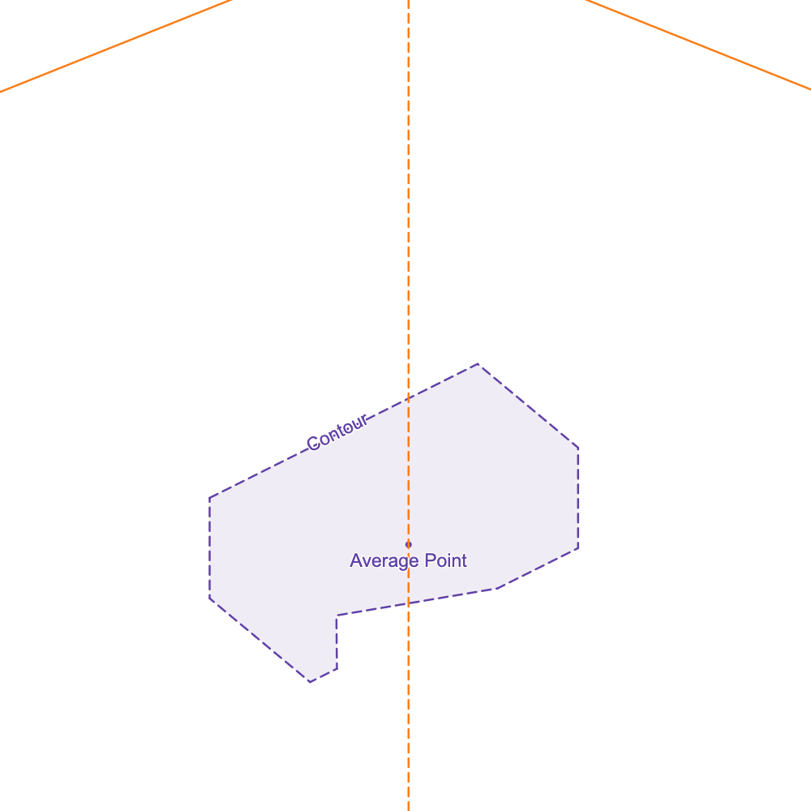

% A Vision System for Into the Deep

# A Vision System for Into the Deep

## Overview
Our system can be split into two components, namely, detecting samples in the image and getting the world coordinates of those samples. The system uses color filtering and an algorithm based on finding key points for the former and reprojection for the latter. Other approaches for sample detection include using machine learning, and alternatives to reprojection include repeatedly moving the robot and rechecking until the sample is at a certain point in its vision. 

## Physical Setup
When using reprojection, it's very important to know the precise location of your camera, in terms of both position and rotation. These values are called ***extrinsics***. Some advice on doing this:

- Keep the camera still (i.e. not on any sort of arm) if possible. You can still use reprojection if you don't, but it will make it   less precise and more complex.
- Mount your camera well. The camera should be screwed in tightly, and only wiggle a couple of millimeters if it gets hit. We used a Logitech C270, and since there's no way to screw in the camera anywhere, we disassembled the camera and designed a custom case.
- Know the position of your camera ***in CAD***. This helps because it is more precise, but it also means you have one less thing to check when debugging.

## Code Setup
We used [EasyOpenCV](https://github.com/OpenFTC/EasyOpenCV) because it is provided by default. [FTC Dashboard](https://github.com/acmerobotics/ftc-dashboard) was useful for tuning the color filter with live feedback. If you're using RoadRunner or Pedropathing, you probably already have FTC Dashboard or Panels (which is similar). [EOCV Sim](https://github.com/deltacv/EOCV-Sim) is very useful for quick iteration and testing without access to your robot.

## Camera Calibration
In camera calibration, we basically try to find some numbers that describe the camera. These are the focal lengths $(f_x, f_y)$, principle point $(c_x, c_y)$, and distortion coefficients $[k_1 ... k_n]$. If you want to understand what these actually are, there's some [information](https://docs.opencv.org/4.x/d9/d0c/group__calib3d.html) on the OpenCV docs.

Camera calibration involves taking images of a surface from which a computer can gain a lot of data, and then putting it into a program which tries to create calibration numbers that match the data. The official FTC documentation provides [information about doing this with 3DF Zephyr](https://ftc-docs.firstinspires.org/en/latest/programming_resources/vision/camera_calibration/camera-calibration.html#calibrating-with-3df-zephyr), but this is only available for Windows. What we ended up doing was using [video2calibration](https://github.com/smidm/video2calibration), which allows you to take input a video and then get camera calibration data. Note that the program will output something called a "camera matrix" like this:
```{.wrap-text}
camera matrix:
[[ 774.6  0.     619.7 ]
 [ 0.     773.0  352.5 ]
 [ 0.     0.     1.    ]]
```
this corresponds to $\begin{bmatrix} f_x & 0 & c_x \\ 0 & f_y & c_y \\ 0 & 0 & 1 \\ \end{bmatrix}$, so in this case $f_x = 774.6$, $f_y = 773.0$, $c_x = 619.7$, and $c_y = 352.5$

Once you have your focal lengths, principal point, and distortion coefficients, there are still some things things left to do:

#. Compute some constants that depend on the focal lengths, principal point, and extrinsics matrix:
    a. The projection matrix, which is used for debugging. It helps display world coordinates on the screen
    a. The reprojection matrix, which is at the center of our vision approach. It converts screen coordinates to world coordinates
#. Put all these numbers into a java file in a way that OpenCV can read them

### Our Python Script

We created a [python script](https://github.com/24090/IntoTheDeep/blob/main/TeamCode/src/main/java/org/firstinspires/ftc/teamcode/vision/ReprojectionMatrixCalculator.py) to complete all these steps (it's not fun to do those things again every time you move your camera or recalibrate it).

How the script works:

1. Gets constants from user
  ```{.python .numberLines}
  focal_length       = (f_x, f_y) # replace these values with the intrinsics
  principal_point    = (c_x, c_y) # and these ones
  distortion         = [ k_1 ... k_n ] # and these ones
  
  rotation_xyz_euler = [rotation_x, rotation_y, rotation_z] # replace these values with the extrinsics
  position           = [x, y, z - 1.5] # and these ones
  # The -1.5 means we want to look 1.5 inches above the ground (at the top of samples)
  degrees            = True # if the rotation values are in degrees (as opposed to radians)
  ```
2. Calculates projection and reprojection matrices
  ```{.python .numberLines}
  intrinsics_matrix = ... # 3x3 matrix determined by focal_lengths and principal_point
  extrinsics_matrix = ... # 3x3 matrix determined by extrinsics

  projection_matrix = (intrinsics_matrix @ extrinsics_matrix)[:, [0,1,3]] # 3x3 matrix, product of intrinsics and extrinsics matrix
  reprojection_matrix = np.linalg.inv(projection_matrix) # 3x3 matrix, inverse of projection matrix
  ```
3. Generates code and places it between comments in Camera.java
  ```{.python .numberLines}
  code = "// generated with ReprojectionMatrixCalculator.py\n" # put in leading comment
  for row_num in range(3): # put in projection matrix
    code += f"pm.put(..."
  code += "\n"
  for row_num in range(3): # put in reprojection matrix
    code += f"rm.put(..."
  code += "\n"
  for row_num in range(3): # put in camera matrix
    code += f"cm.put(..."
  code += "\n"
  for col_num, value in enumerate(distortion): # put in distortion matrix
    code += f"\t\tdc.put(0, {col_num}, {value: e});\n"
  code += "\t\t// end" # put in trailing comment
  
  text = open("Camera.java", "r").read() # reads from Camera.java
  # isolate the old code between the leading and trailing comment
  text = text.replace("// generated with ReprojectionMatrixCalculator.py", "RMC_SPLIT")
  text = text.replace("// end", "RMC_SPLIT")
  text = text.split("RMC_SPLIT") 
  # replace it with the new code 
  text[1] = code
  # ask to save changes
  if (input("autoreplace? ") == "y"):
    open("Camera.java", "w").write("".join(text))
  ```
::::::::: {.infobox}
### To use it for yourself:
- Put [the script](https://github.com/24090/IntoTheDeep/blob/main/TeamCode/src/main/java/org/firstinspires/ftc/teamcode/vision/ReprojectionMatrixCalculator.py) in whatever folder your using for your vision code
- Input your constants at the top of the script
- Put our [Camera.java file](https://github.com/24090/IntoTheDeep/blob/main/TeamCode/src/main/java/org/firstinspires/ftc/teamcode/vision/Camera.java) in the same folder.
Feel free to modify and redistribute either of these scripts. 
:::::::::

## Writing Code with EasyOpenCV 
Now, we have all the data we need, and can move on to coding our algorithm. But when writing code with EasyOpenCV, there are a few things to keep in mind.

### Setting up the Codebase
This involves initialising your camera and the concept of a "pipeline". Refer to the [EasyOpenCV documentation](https://github.com/OpenFTC/EasyOpenCV?tab=readme-ov-file#documentation).

### Preventing Memory Leaks
If you create a `Mat`{.java} during the main loop, you will get warnings telling you about memory leaks. To resolve this, initialise all your `Mat`{.java}s at the top of your pipeline, like this:

  ```{.java}
  public class SampleLocationPipeline extends OpenCvPipeline {
      ...
      Mat input_undistort = new Mat();
      Mat color_mask_upper = new Mat();
      Mat color_mask = new Mat();
      Mat color_filtered_image = new Mat();
      Mat output = new Mat();
      final Mat empty_mat = new Mat();
      Mat hierarchy = new Mat();
      Mat greyscale = new Mat();
      ...
      public Mat processFrame(Mat input) {
          ...
  ```

### Pass By Reference
When using OpenCV functions, for example `Imgproc.cvtColor`{.java}, you will assign variables without using `=` sign. Instead of writing things like

```{.java}
Mat ycrcb_image = Imgproc.cvtColor(rgb_image, Imgproc.COLOR_RGB2YCrCb)
```

you write things like

```{.java}
Mat ycrcb_image;
... //                      Passed by reference
Imgproc.cvtColor(rgb_image, ycrcb_image,        Imgproc.COLOR_RGB2YCrCb)
```

You are giving the function a reference to ```ycrcb_image```{.java} and the function is handling the "assignment" for you.

## Initial Processing
1. Undistort image using distortion coefficients
  ```java
  Calib3d.undistort(input, input_undistort, Camera.camera_matrix, Camera.distortion_coefficients);
  ```
  This allows us to use the image accurately later on.
  
2. RGB -> [YCbCr](https://en.wikipedia.org/wiki/YCbCr)
  ```java
  Imgproc.cvtColor(input_undistort, input_undistort, Imgproc.COLOR_RGB2YCrCb);
  ```
  This will become useful when filtering colors, because the colors of the samples are much easier to separate in this colorspace
  
## Color Filtering
```{.java}
switch (color) { // Decide what to do based on the color
    case RED:
        // make sure colors are in this range
        Core.inRange(input_undistort, Camera.ColorValues.red_min, Camera.ColorValues.red_max, color_mask);
        break;
    case BLUE:
        Core.inRange(input_undistort, Camera.ColorValues.blue_min, Camera.ColorValues.blue_max, color_mask);
        break;
    case YELLOW:
        Core.inRange(input_undistort, Camera.ColorValues.yellow_min, Camera.ColorValues.yellow_max, color_mask);
        break; 
}
```
Note that `Camera.ColorValues.red_min`{.java}, `Camera.ColorValues.blue_max`{.java}, etc. are 3 values packaged together in `Scalar`{.java}s, each component representing Y, Cr and Cb respectively. 
YCrCb is a very helpful color space to do this in, because essentially: 

- Blue -> High Cb
- Red -> High Cr
- Yellow -> Low Cb

Tuning with YCrCb was much easier than HSV in our experience. Using FTC Dashboard, Panels, or EOCV Sim with the camera plugged into your computer means you can tune these mins and maxes with live feedback, making the process quick (and you ***need*** to be quick in order to retune for lighting conditions at competitions).

The result of this process is a black and white image (`color_mask`{.java}), based on whether or not the color was in the color range.

## Morphology

After we've filtered for colors, there is still random noise in our image that can mess up later steps.
```{.java}
Imgproc.erode(color_mask, color_mask, empty_mat, new Point(-1, -1), 5);
Imgproc.dilate(color_mask, color_mask, empty_mat, new Point(-1, -1), 10);
Imgproc.erode(color_mask, color_mask, empty_mat, new Point(-1, -1), 5);
```
This basically contracts, expands, and contracts the white parts of the black and white image. The end result of this process is that any small blobs of white are removed, and any large blobs are essentially unchanged. After this, we don't have to worry so much about random noise.

## Contours

```{.java}
Imgproc.findContours(color_mask, contours, hierarchy, Imgproc.RETR_EXTERNAL,Imgproc.CHAIN_APPROX_NONE );
```
This function gives us the outlines (i.e. a list of points on the edge) of all the different blobs on the image before.

## Getting Top Points
This is (as far as i know) the most unique part of our approach. We first find the two top (from which we can later "solve" the sample). How do we find those points though?

We know four things about the top corner points:

1. They are in our list of points (contour) from before 
2. They have high y values (optimize $point_y$)
3. They are far from the center horizontally (optimize $|point.x - center.x|$)
4. They are far from eachother horizontally (optimize $|point_a.x - point_b.x|$)

First, to find the $center_x$, we take the average x value of all the points in the contour.
```{.java}
double center_x = 0;
for(Point point: points2f.toList()){
    center_x += point.x;
}
center_x /= points2f.size().area();
```

Then, to find our first top corner, we score each point based on a weighted combination of their y values (criterion 2) and distance from center (criterion 3), and pick the best one.

  ```{.java}
  double max_primary_score = Double.NEGATIVE_INFINITY;
  Point primary_top_point = null;
  for(Point point: points2f.toList()){
      // bias to be far on the x axis
      double score = -point.y + Math.abs(center_x - point.x) * top_distance_weight;
      if (score > max_primary_score){
          max_primary_score = score;
          top_x = point.x;
          primary_top_point = point;
      }
  }
  ```
We do the same for the second point, except using a weighted combination of their y values (criterion 2) and distance from the first point (criterion 4).

  ```{.java}
  double max_secondary_score = Double.NEGATIVE_INFINITY;
  Point secondary_top_point = null;
  for(Point point: points2f.toList()){
      // bias to be far on the x axis
      double score = -point.y + Math.abs(top_x - point.x) * top2_distance_weight;
      if (score > max_secondary_score){
          max_secondary_score = score;
          secondary_top_point = point;
      }
  }
  ```

Here's a visualisation of the algorithm:


## Calculating the Sample's Pose
Now that we have the sample's top two corners, we can get some more information about it.

::::::::: {.infobox}
### Screen -> World calculations?
See the [`Camera.uv2world`{.java} function in our Camera.java file](https://github.com/24090/IntoTheDeep/blob/main/TeamCode/src/main/java/org/firstinspires/ftc/teamcode/vision/Camera.java#L64). It's just a little bit of math which applies the reprojection matrix to the screen coordinate you give it.
:::::::::

Since we can get the world coordinates from the screen coordinates (that was the point of our calibration), we can get the two points of the sample in world coordinates, and from there, the sample world center and angle.

Here's a visualization (try moving the black points around)
<iframe src="https://www.desmos.com/calculator/3af8j3rxsw?embed" style="display: block; margin: auto; aspect-ratio:1; width: min(90%, 500px);border: 1px solid #ccc" frameborder=0></iframe>
This is what the math does:

- Get the distance between the two points (using $\sqrt{(a_x-b_x)^2 + (a_y-b_y)^2}$)
  - If in an acceptable range of $1.5 \mathrm{in}$, classify the side as short
  - If in an acceptable range of $3.5 \mathrm{in}$, classify the side as long
  - Otherwise, ignore this pair of points
- To get the center coordinate:
  1. Get the slope between the points, rotated $90º$, using $\frac{-(a_x-b_x)}{a_y-b_y}$
  2. Create a unit vector based off of this slope, $\frac{\begin{bmatrix}1\\\mathrm {slope}\end{bmatrix}}{\sqrt{1 + \mathrm{slope}^2}}$
  3. If the vector points upwards, multiply it by $-1$ to make it point downwards instead.
  4. Scale the vector by $\frac{1.5 \mathrm{in}}{2}$ if it's a long side or $\frac{3.5 \mathrm{in}}{2}$ if it's a short side
  5. Add the vector to the center of points $a$ and $b$, giving $\mathrm{center} = 
  \begin{bmatrix}
  \frac{a_x + b_x}{2} + v_x
  \\
  \frac{a_y + b_y}{2} + v_y
  \end{bmatrix}
  $
- Get the angle between the points (using $\arctan(\frac{a_y-b_y}{a_x-b_x})$)
  - If it's a short side, add $90º$ ($\frac{\pi}{2} \mathrm {rad}$) to it.
  
## Grabbing the sample
Now that you know exactly where the sample is and how it is rotated, all that's left is to grab it. This requires precise control. We used Pedro Pathing for movement (although it often didn't work well for small movements) and a P controller for our linear slide. We found we didn't even need to rotate the claw exactly, our setup worked well enough with just 90 degree rotations.

## Limitations
This article is just an overview of how ***we*** implemented vision for the game. It can definitely be improved upon, and likely won't work outside of our specific use case. The system wouldn't work, for example, if the camera was moving or if we were doing something other than looking for samples in the submersible.